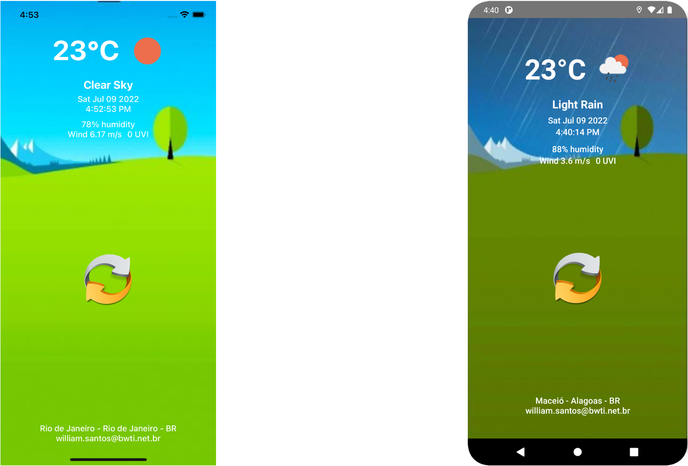

# Challenge Weather App

Projeto desafio do processo seletivo da empresa Builders

    

    
    

## Tecnologias utilizadas

- Axios
- Community Geolocation
- Date FNS
- Env Config
- Redux Toolkit
- Redux Saga
- Typescript
- Styled Components

## API

- Para obter os dados meteorológicos foi utilizada a API `https://openweathermap.org/api`

## Instalação

- Clone este repositório: `git clone https://github.com/bwti/challenge-weather-app.git`
- Entre na pasta através do comando: `cd challenge-weather-app`
- Instalar todas as dependências do projeto: `yarn install`

## Feedback

Feedbacks são sempre bem vindos.
